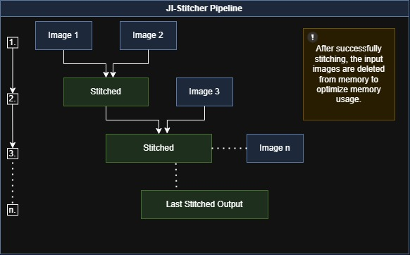

<div align="center">


# JI-Stitcher

<h4>
    <a href="#overview">Overview</a> |
    <a href="#features">Features</a> |
    <a href="#architecture">Architecture</a> |
    <a href="#requirements">Requirements</a> |
    <a href="#contact">Contact</a>
</h4>

> A cutting-edge image stitching solution optimized for mobile devices and computational efficiency

[](LICENSE)
[](https://www.python.org/)
[](https://opencv.org/)
[](#)
[](#)
[](https://github.com/cavadibrahimli1/JI-Stitcher)

<kbd>
    
</kbd>

</div>

## Overview

JI-Stitcher is a state-of-the-art image stitching solution that combines advanced computer vision techniques with optimized memory management. Perfect for creating seamless panoramas while maintaining efficiency on resource-constrained devices.

### Key Highlights
- **High Performance:** Optimized for mobile devices and resource-constrained environments
- **Smart Memory Management:** Progressive cleanup and efficient resource utilization
- **Precise Stitching:** Advanced algorithms for accurate image alignment
- **Seamless Blending:** Professional-grade output quality

## Features

<table>
<tr>
<td width="50%">

### Performance Optimization

- **Memory Management**
  - Smart resource allocation
  - Progressive cleanup system
  - Optimized memory footprint

- **Processing Efficiency**
  - Fast feature detection
  - Optimized matching algorithms
  - Parallel processing support

- **Platform Support**
  - Cross-platform compatibility
  - Mobile device optimization
  - Hardware acceleration
</td>
<td width="50%">

### Quality Assurance

- **Image Processing**
  - Advanced feature detection
  - Robust matching algorithms
  - Precise alignment system

- **Output Enhancement**
  - Multi-band blending
  - Color correction
  - Exposure compensation

- **Integration**
  - Simple API interface
  - Flexible configuration
  - Comprehensive documentation
</td>
</tr>
</table>

## Architecture

Our image stitching pipeline follows a sophisticated workflow designed for both efficiency and quality:

<table>
<tr>
<td width="33%" align="center">

### Input Processing
- Image preprocessing
- Feature extraction
- Memory optimization
</td>
<td width="33%" align="center">

### Feature Analysis
- SIFT detection
- Robust matching
- RANSAC filtering
</td>
<td width="33%" align="center">

### Image Alignment
- Homography computation
- Precision alignment
- Quality validation
</td>
</tr>
</table>

### Processing Pipeline

1. **Input Stage**
   - Image acquisition and validation
   - Initial quality assessment
   - Resource management initialization

2. **Analysis Stage**
   - Feature point detection
   - Matching and verification
   - Geometric relationship analysis

3. **Output Stage**
   - Image composition
   - Color and exposure harmonization
   - Final quality optimization

## Requirements

<table>v
<tr>
<td width="70%">

### Core Dependencies
```python
python >= 3.7
opencv-python == 4.5.5
numpy >= 1.19.0
scipy >= 1.6.0
```
</td>
<td width="30%">

### System Requirements
- RAM: ≥ 4GB
- CPU: Multi-core processor
- GPU: Optional, but recommended
</td>
</tr>
</table>

## Contact

<div align="center">

[](https://github.com/cavadibrahimli1/JI-Stitcher/issues)
[](https://github.com/cavadibrahimli1/JI-Stitcher/discussions)
[](https://github.com/cavadibrahimli1/JI-Stitcher)

</div>

## License

This project is licensed under the MIT License - see the [LICENSE](LICENSE) file for details.

---

<div align="center">
    <sub>Developed by <a href="https://github.com/cavadibrahimli1">Javad Ibrahimli</a></sub>
    <br>
    <sub>© 2024 Javad Ibrahimli. All rights reserved.</sub>
</div>
